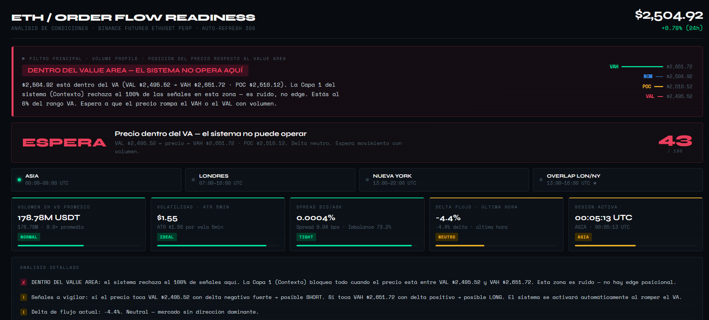
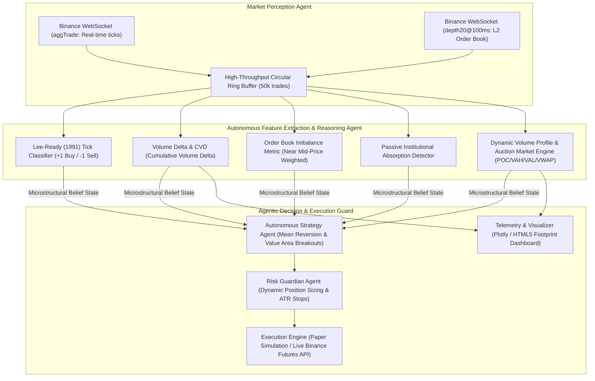

# Autonomous Crypto Microstructure & Order Flow Trading Agent

[](https://www.python.org/downloads/)
[]()
[](https://binance.com/)
[](https://opensource.org/licenses/MIT)
[]()
[]()

An institutional-grade, asynchronous **Autonomous Microstructure Trading Agent** designed for cryptocurrency derivatives on **Binance Futures (ETH/USDT)**. 

Unlike traditional bots that rely on lagging technical indicators (RSI, MACD, Moving Averages), this **Agentic Decision System** continuously perceives, reasons about, and reacts to raw market microstructural state: high-throughput aggressive order flow, real-time Level-2 order book liquidity imbalances, and institutional absorption.

---

## 🖥️ Market Microstructure Analyzer Interface



---

## 🤖 Multi-Agent Microstructure Architecture

This system operates as a specialized **Agentic Multi-Layer Pipeline**, where autonomous perception and reasoning modules convert raw WebSocket data into institutional alpha:



---

## 🧠 Autonomous Microstructural Reasoning Modules

1. **Perception & Tick Classification (`data/websocket_client.py` & `processing/order_flow.py`):**
   * Employs the academic **Lee-Ready (1991)** algorithm to classify trades into aggressive buyer volume ($+1$) vs aggressive seller volume ($-1$).
2. **Cumulative Volume Delta (CVD) Reasoning:**
   $$\Delta = \text{Volume}_{\text{aggressive buyers}} - \text{Volume}_{\text{aggressive sellers}}$$
   $$\text{CVD}_t = \text{CVD}_{t-1} + \Delta_t$$
   * The Agent detects **CVD vs. Price Divergences**: identifying when price pushes higher without genuine aggressive buying volume, signaling imminent exhaustion.
3. **Order Book Liquidity Imbalance:**
   $$\text{Imbalance} = \frac{\sum \text{Bid Quantity} - \sum \text{Ask Quantity}}{\sum \text{Bid Quantity} + \sum \text{Ask Quantity}}$$
   * Weighted dynamically across top 20 levels prioritizing depth near the mid-price to anticipate liquidity traps.
4. **Institutional Absorption Detection:**
   * Flags high-delta clusters met by zero price progress—revealing large institutional passive limit orders silently absorbing liquidity.
5. **Auction Market Theory Engine (`processing/volume_profile.py`):**
   * Continuously recalculates the Point of Control (**POC**), Value Area High (**VAH**), Value Area Low (**VAL**), and volume-weighted average price (**VWAP**).

---

## 📁 Repository Structure

```
crypto-orderflow-engine/
├── data/
│   ├── data_buffer.py       # High-speed circular trade and order book buffer
│   ├── data_collector.py    # Asynchronous live trade streaming recorder
│   ├── websocket_client.py  # Resilient Binance WebSocket client with auto-reconnect
│   └── historical/
│       └── eth_backtest.csv # Sample historical tick dataset for validation
├── processing/
│   ├── order_flow.py        # Microstructure feature engine (Delta, CVD, Absorption)
│   ├── volume_profile.py    # Auction theory profile (POC, VAH, VAL, VWAP)
│   └── footprint.py         # Bid/Ask tick cluster footprint generator
├── strategy/
│   ├── signals.py           # Autonomous strategy agent & divergence triggers
│   └── risk_manager.py      # Capital preservation & dynamic SL/TP calculation
├── execution/
│   └── trader.py            # Paper trading & live Binance execution interface
├── visualization/
│   ├── charts.py            # Plotly order flow & volume profile renderer
│   └── dashboard.py         # Real-time telemetry dashboard
├── backtesting/
│   └── engine.py            # Event-driven historical backtesting simulator
├── tools/
│   ├── quickstart.py        # Environment self-test script
│   └── generate_test_data.py# Synthetic tick generator for stress testing
├── eth_market_analyzer.html # Standalone interactive HTML5 visualizer
├── run_backtest.py          # Backtest runner script
├── main.py                  # Live WebSocket agent loop
├── requirements.txt         # Python dependencies
└── README.md
```

---

## 🚀 Quickstart Guide

### 1. Installation
```bash
git clone https://github.com/YOUR_USERNAME/crypto-orderflow-engine.git
cd crypto-orderflow-engine
python -m venv .venv

# Activate venv
.venv\Scripts\activate   # Windows
source .venv/bin/activate # Linux/macOS

pip install -r requirements.txt
```

### 2. Run Historical Backtest (Zero API Keys Required)
Run the backtesting engine on real tick data:
```bash
python run_backtest.py
```
Outputs trade execution logs and generates an interactive equity curve report.

### 3. Run Live Stream Agent (Paper Trading Mode)
Connect the perception agent to Binance Futures public WebSockets in real time:
```bash
python main.py
```

### 4. Interactive Visual Footprint
Open `eth_market_analyzer.html` in any web browser to view candlestick, order book imbalance, and footprint profiles.

---

## 📜 License
This project is licensed under the MIT License - see the LICENSE file for details.
